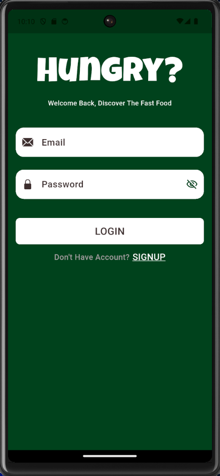
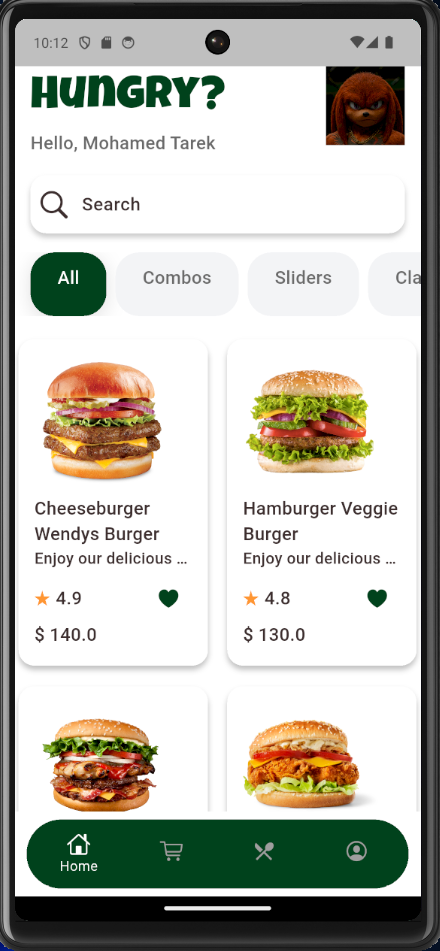
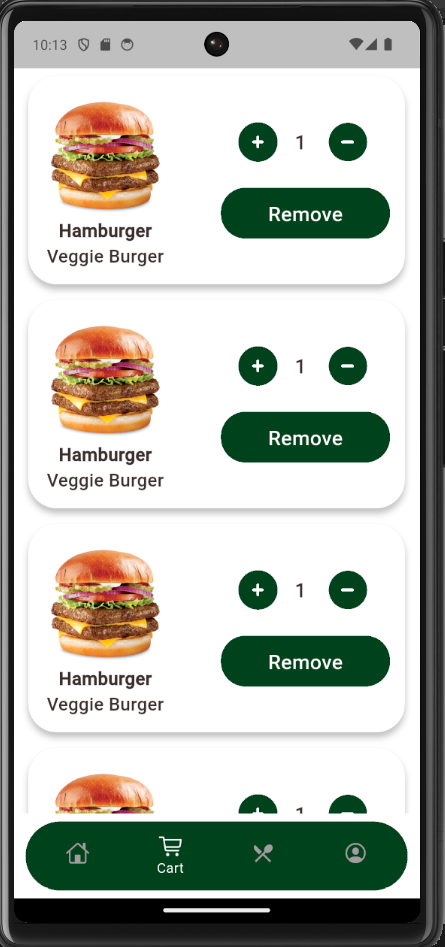
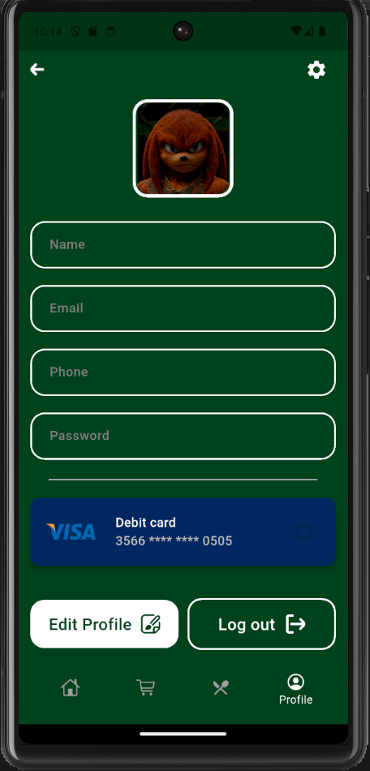
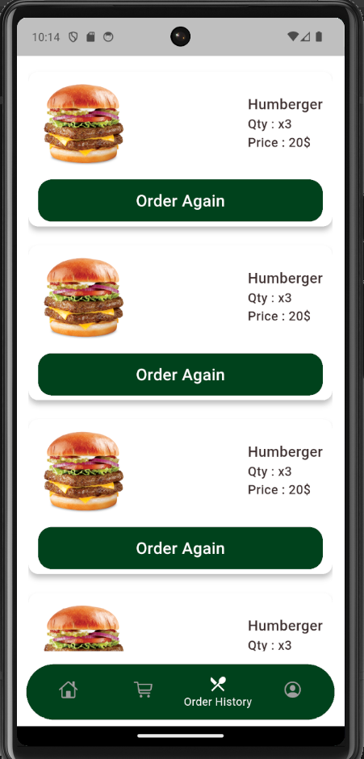

# 🍔 Hungry App

Hungry App is a **restaurant mobile application** that allows users to browse meals, add items to the cart, place orders, and pay online.  
The application is fully connected to a **real backend**, providing a complete and realistic food ordering experience.

---

## 🚀 Features
- 🔐 Authentication (Login & Register)
- 🏠 Home (Browse meals & categories)
- 🛒 Cart (Add, remove, and update items)
- 👤 Profile (User information)
- 📦 Order History (View previous orders)
- 🔗 Connected to a real backend (API)

---

## 🛠️ Technologies Used
- Flutter
- Dart
- State Management (Bloc / Cubit)
- RESTful API
- Clean Architecture

---

## 📸 Screenshots

  
  
  

  
  

---

## 📂 Project Structure
